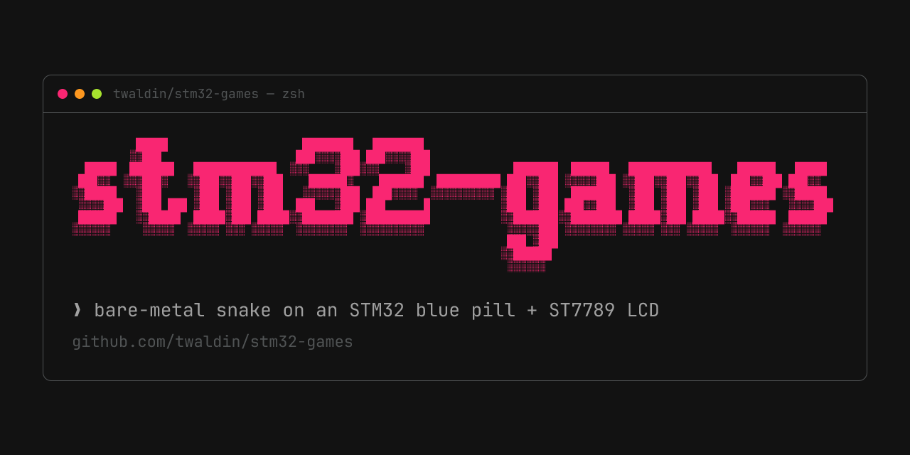

# Demo

https://github.com/user-attachments/assets/70148411-9735-4580-92b2-bc103c99f7ae

# STM32 and ST7789 Games

This project is a personal project for experimenting with the STM32F103C8T6 microcontroller and a display with a st7789 driver. The goal is to create a simple, handheld game console. This repository contains the game code and display driver; libopencm3 must be cloned and built separately as described below. Currently only has snake game.

## Hardware

To build this project, you will need the following hardware components:

*   **Microcontroller:** STM32F103C8 (Blue Pill)
*   **Display:** Display Module with ST7789 driver. I am using **[this](https://www.amazon.com/2inch-IPS-LCD-Display-Module/dp/B082GFTZQD?crid=2IX6GI59INLIT&dib=eyJ2IjoiMSJ9.s3-hl7a5ue_GjWCifla5J8apm1oCu0YHjZy0uU0FWFWi5ZvsyW5i_QkCFqnsooiDFiwwC9GZJomNftnrOI6A-TAiV-z3WZB4YX5tg15HqZLWhLFl0q72AlWEKmm7nBH_lUtsRSPbYgJ4TZZECdkJljX_q1FraQLkVlkxCi_1InuLO_BvVklPGrPKvpK3BLxIPP_K91C3gRex_n1iyZl03v_J9SzTk62eExP8jyXHo4BZCnDfmIqHBNx6Uj3W2athYzmiCPf9zufb5hb6mlYbLKIGG4BA3-3HJE4s3hfcwrQ.auTAsXPaRt5ie3zBVxLuBJusdl3diSsWXDf4GxaGv90&dib_tag=se&keywords=st7789&qid=1748296073&s=industrial&sprefix=st7789%2Cindustrial%2C188&sr=1-1&th=1)** screen
*   **Buttons:** Any normal breadboard connector type buttons should work. I am using **[these](https://www.amazon.com/OCR-180PcsTactile-Momentary-Switches-Assortment/dp/B01MRP025V?crid=1YE0NK31AGPFC&dib=eyJ2IjoiMSJ9.ik_w5KInwh5rzyP-17_EWzy9taVbw4UHS79WAf3vwicSkih2PCBWMgurp5zSJIiZCln4egxdN7SkUdZXyjIlvpB76MfbYyy0Gnawzk-x3WGwEgQINlLYBfCkDPop65blfi7wA7SJFxbsH12tSIjswc69XHw2NGZ9E0UWhiUyJFJi5-yNxxwbdtC2xIoD4DLBnqY-KuZjxp93sQ73KS4d6l_e5510MGy9qHSRSwsfXWknkiBNV8saoZU7gUldsaW1K8cA7TvStc4XQFyKonx7wxL9UVAx1bGK6d3RMvlwjF4.4dqdnOjfq9xQetDMx8CEgrTiy54nHC_hF_KTPIp5rMk&dib_tag=se&keywords=electronic%2Bbuttons%2Blinear&qid=1749705341&s=industrial&sprefix=electronic%2Bbuttons%2Blinear%2Cindustrial%2C137&sr=1-6&th=1)** buttons
*   **Breadboard and Jumper Wires:** Any
*   **ST-Link V2:** To flash the code onto the microcontroller

## Software

This project relies on the following software:

*   **[libopencm3](https://github.com/libopencm3/libopencm3):** open-source library for ARM Cortex-M microcontrollers. The Makefile expects it in `libopencm3/` inside this checkout.
*   **[st7789 driver](https://github.com/abhra0897/stm32f1_st7789_spi):** A driver for the ST7789 display, included in [`driver/`](driver/). No separate driver clone is needed.
*   **[ARM GCC Toolchain](https://developer.arm.com/tools-and-software/open-source-software/developer-tools/gnu-toolchain/gnu-rm/downloads):**
    *   **Linux (Debian/Ubuntu):** `sudo apt install gcc-arm-none-eabi binutils-arm-none-eabi`
    *   **Linux (Arch):** `sudo pacman -S arm-none-eabi-gcc arm-none-eabi-binutils`
    *   **macOS:** `brew install --cask gcc-arm-embedded`
    *   **Windows** good luck to you, maybe try wsl2?
*   **Make:** 
    *   **Linux (Debian/Ubuntu):** `sudo apt install build-essential`
    *   **Linux (Arch):** `sudo pacman -S make`
    *   **macOS:** Install Xcode Command Line Tools. `xcode-select --install`
*   **Git and Python 3:** Git is used to clone the repositories; libopencm3 requires Python to generate code during its build.
*   **[st-flash](https://github.com/stlink-org/stlink):** For flashing code to the device. Follow the installation instructions in the official repository. You will likely need `libusb-1.0-0-dev` (`sudo apt install libusb-1.0-0-dev` on debian).

## Wiring

### Screen

| Pin | STM32F103C8 |
|-----|-------------|
| VCC | 5V          |
| GND | G           |
| DIN | GPIO A7     |
| CLK | GPIO A5     |
| CS  | GPIO A6     |
| DC  | GPIO A2     |
| RST | GPIO A4     |
| BL  | GPIO A3     |

### Buttons

| Button | STM32F103C8 |
|--------|-------------|
| LEFT   | GPIO B12    |
| UP     | GPIO B13    |
| RIGHT  | GPIO B14    |
| DOWN   | GPIO B15    |

**Mapping discrepancy:** The table above preserves the original wiring notes. In the current [`main.c`](main.c), `is_down_pressed()` reads PB13 and `is_up_pressed()` reads PB15, the reverse of the UP/DOWN labels above. Confirm the physical button orientation before changing the wiring or firmware; it has not been verified here.

## Building

The current [`Makefile`](Makefile) uses the `arm-none-eabi` toolchain, Newlib (`nano.specs` and `nosys.specs`), and a hard-coded `--sysroot=/usr/arm-none-eabi` in both `CFLAGS` and `LFLAGS`. Ensure the toolchain binaries are on `PATH` and its C library/specs are installed. The package commands above do not guarantee that sysroot layout; other installations, including macOS, may require adjusting those Makefile paths. These instructions have been checked against source, not validated by compiling or running hardware.

1.  **Clone the repository:**
    ```bash
    git clone https://github.com/twaldin/stm32-games.git
    cd stm32-games
    ```

2.  **Clone libopencm3 into the project directory:**
    ```bash
    git clone https://github.com/libopencm3/libopencm3
    ```

3.  **Build libopencm3 for STM32F1:**
    ```bash
    cd libopencm3
    make TARGETS=stm32/f1
    cd ..
    ```

4.  **Build the project:**
    ```bash
    make PREFIX=arm-none-eabi
    ```

    `PREFIX` is needed because the size-report recipe uses `$(PREFIX)-size`, while the other recipes use `TOOLCHAIN_PREFIX`. The build produces `main.elf`, `main.bin`, `main.hex`, `main.lst`, and `main.map`, and prints a size report. It does not flash the device.

The dependency is not pinned to a tested libopencm3 revision; compatibility with its latest upstream version remains unverified.

## Source layout

*   [`main.c`](main.c): clock, button and display setup, start screen, and launch of Snake.
*   [`snake.c`](snake.c) and [`games.h`](games.h): Snake implementation and shared declarations.
*   [`driver/st7789_stm32_spi.h`](driver/st7789_stm32_spi.h): display pin, SPI, and DMA configuration.
*   [`fonts/`](fonts/) and [`images/`](images/): font and bitmap assets.
*   [`Makefile`](Makefile), [`stm32f103xb.ld`](stm32f103xb.ld), and [`cortex-m-generic.ld`](cortex-m-generic.ld): build recipes and linker scripts. The selected memory map allocates 128 KiB flash and 20 KiB RAM; confirm that capacity for your board rather than assuming it from the Blue Pill name.

## Flashing

To flash the firmware onto the STM32F103C8, you will need to have the `st-flash` utility installed. Follow the **[stlink installation instructions](https://github.com/stlink-org/stlink)**.

Build the firmware first: `make burn` only writes the existing `main.bin` and does not rebuild it. Once `st-flash` is installed, connect the ST-Link V2 to your computer and the STM32F103C8, then run the following command:

```bash
make burn
```

## TODO

*   **Tetris Game:** work on making Tetris
*   **Sound:** Add a buzzer for sound effects
*   **3D Printed Case:** Design and print a case to house the components for true handheld-ness.

## Contributing

Contributions are welcome! If you have any ideas, suggestions, or improvements, please feel free to open an issue or submit a pull request.

## License

Project code is licensed under the [MIT License](LICENSE), except where a file carries its own license. The display driver retains its [MIT license and Avra Mitra attribution](driver/LICENSE). The libopencm3-derived linker scripts carry LGPL-3.0-or-later notices; libopencm3 itself is also LGPL-3.0-or-later (see its `COPYING.LGPL3` and `COPYING.GPL3` files after cloning).
